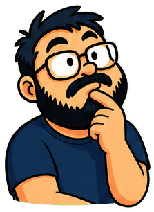
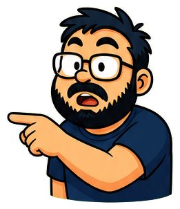
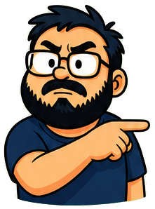
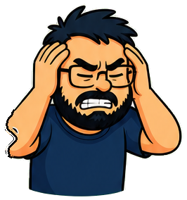
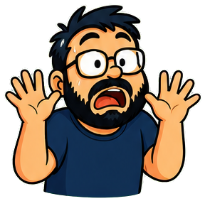
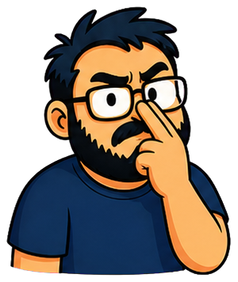
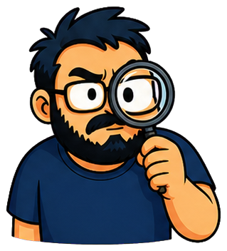
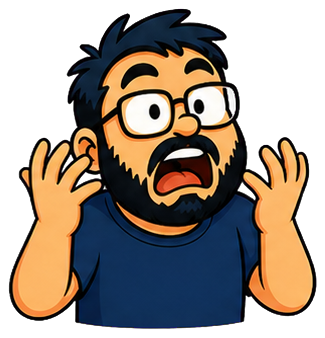
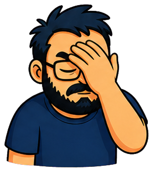

# Tony Pose Library

The 12 poses from the character sheet, sliced into individual PNGs in [`public/tony/`](../public/tony/). Names follow the Brand Bible's core pose library.

## Using poses in lessons

Start any blockquote with a pose tag to pick Tony's expression in the **Tony's Frame** callout:

```markdown
> [pose: excited] The rule creates the behavior. Feedback creates the experience.
```

Quotes **without** a tag automatically rotate through `explaining → expert → excited → thinking`, so every frame gets a Tony either way.

## Using poses in components

`DialogueBox` accepts an optional `pose` prop:

```tsx
<DialogueBox pose="frustrated" heading="Development rule of thumb" lines={[...]} />
```

Without `pose`, it falls back to the photo (`/tony.png`).

## The poses

| Pose | Tag | When to use |
| --- | --- | --- |
|  | `[pose: explaining]` | Neutral teaching voice. The default — introducing a concept, walking through an idea. |
|  | `[pose: thinking]` | Thoughtful, finger on chin. Posing a question, weighing a tradeoff, "hmm, why is that?" |
|  | `[pose: pointing-left]` | Stern point to the left. Calling out a problem, "look at what this code is doing." |
|  | `[pose: pointing-right]` | Shocked point to the right. "Wait — look at THAT!" Surprising evidence. |
|  | `[pose: pointing-left-shocked]` | The shocked point, mirrored to face left. |
|  | `[pose: pointing-right-angry]` | The stern point, mirrored to face right. |
|  | `[pose: excited]` | Excited discovery! The payoff moment, the aha, the reason the mechanic is cool. |
|  | `[pose: skeptical]` | Arms crossed, unconvinced. Challenging a common assumption or a "best practice" that isn't. |
|  | `[pose: confused]` | Shrugging. Naming the confusion every learner feels before the explanation lands. |
|  | `[pose: frustrated]` | Head in hands, debugging. Bug stories, production pain, "we've all been here." |
|  | `[pose: panic]` | Jump-scare panic. Horror-game bits, scary-sounding topics, dramatic warnings. |
|  | `[pose: laughing]` | Big laugh. Jokes landing, absurd bugs, playful asides. |
|  | `[pose: deadpan]` | The deadpan stare. Dry humor, "yes, the engine really does that." |
|  | `[pose: expert]` | Whiteboard mode with pointer. Formal definitions, vocabulary, the authoritative frame. |
|  | `[pose: adjusting-glasses]` | Pushing up the glasses, all business. "Let's look at this properly." Pre-deep-dive. |
|  | `[pose: idea]` | Finger up, delighted. The lightbulb moment, a tip, "here's the trick." |
|  | `[pose: investigating]` | Magnifying glass. Research mode — digging into a mechanic, reading the fine print. |
|  | `[pose: annoyed]` | Quietly irritated. Janky mechanics, bad defaults, "why does it do that." |
|  | `[pose: gasp]` | Hands up, jaw dropped. Plot twists, shocking reveals, "the game was doing WHAT?" |
|  | `[pose: proud]` | Eyes closed, satisfied. Job well done, a shipped feature, post-exercise glow. |
|  | `[pose: facepalm]` | The classic. Obvious-in-hindsight bugs, self-deprecating dev stories. |
|  | `[pose: whisper]` | Hand beside mouth, sly. Insider tips, secrets, "between you and me…" |
|  | `[pose: notes]` | Clipboard and pencil. Checklists, playtest observations, gathering requirements. |
|  | `[pose: graduate]` | Donning the mortarboard. Course completions, graduation moments, leveling up. |
|  | `[pose: stop]` | Palm out, stern. Warnings, common mistakes, "don't do this." |
|  | `[pose: shush]` | Wink and a finger to the lips. Spoiler territory, easter eggs, secret techniques. |

## Adding a new pose

1. Drop the PNG (transparent background) into `public/tony/`.
2. Add its name to the `tonyPoses` array in [`src/lib/lessons.ts`](../src/lib/lessons.ts) — that whitelists it for `[pose: ...]` tags and the `DialogueBox` prop.
3. Add a row to this table.
